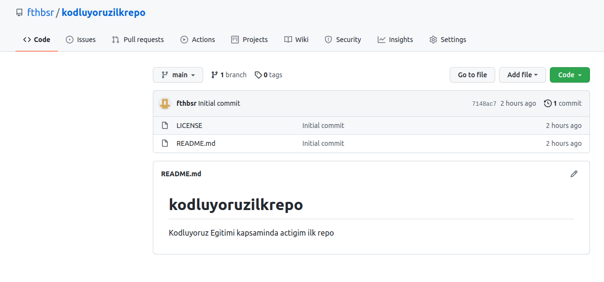

# Kodluyoruz Ilk Repo
Bu repo Kodluyoruz Front -End Egitiminde olusturdugumuz ilk repo.Icerisinde bir adet README dosyasi , bir adet de index.html barindiriyor.


--------------------------
## Installation
Öncelikle projeyi clonelayın.
```
git clone https://github.com/fthbsr/kodluyoruzilkrepo.git
```
## Usage
Projeyi cloneladıktan sonra Visual Studio Code programında açınız.

Linux için:
```
cd kodluyoruzilkrepo
code .
```
## Contributing
Pull requestler kabul edilir. Buyuk degisiklikler icin , lutfen once neyi degistirmek istediginizi tartismak icin bir konu aciniz.

## License

[MIT]('https://opensource.org/licenses/MIT')